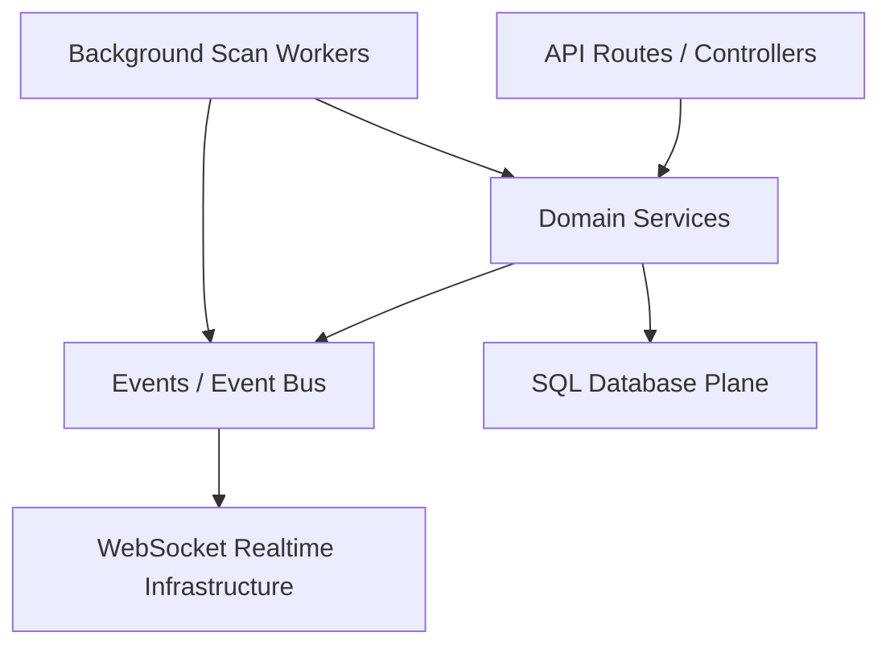

# Service Governance & Domain Ownership Dependency Map

This document establishes the architecture flow and boundaries of the NisargHunter AI platform to prevent circular dependencies, govern communication standards, and enforce domain isolation.

## Domain Definitions & Boundaries

1. **Reconnaissance & Scan Plane** (`backend/workers`, `backend/scanners`)
   - **Responsibility**: Safe, shell-free target processing and continuous monitoring.
   - **Standard**: Triggers execution asynchronously. Must never query AI decision tables directly. Relies on `PriorityQueue`.

2. **AI & Reasoning Plane** (`backend/ai`)
   - **Responsibility**: Context window tracking, prompt compression, structured vulnerability triage, and mentorship logic.
   - **Standard**: Interfaced via `AIOrchestrator`. Budget thresholds enforced globally. Never runs terminal utilities directly.

3. **Collaboration & Telemetry Plane** (`backend/collaboration`, `backend/observability`)
   - **Responsibility**: Multi-user shared workspaces, investigation logs, and tracing spans.
   - **Standard**: Subscribed to the Event Bus. Updates the entity relationship graph using validated event contracts.

## Service Communication Standards

- **Strict Async Layering**: No service should synchronously wait on another service that spans networks. All multi-node flows must yield control via Redis Streams.
- **No Circular Imports**: Dependencies flow downward (`API` -> `Services` -> `Database/Core`). Any horizontal domain messaging must occur over the Redis stream event bus.
- **Organization Isolation**: Every query and database transaction MUST explicitly filter by `organization_id` or `workspace_id`.
